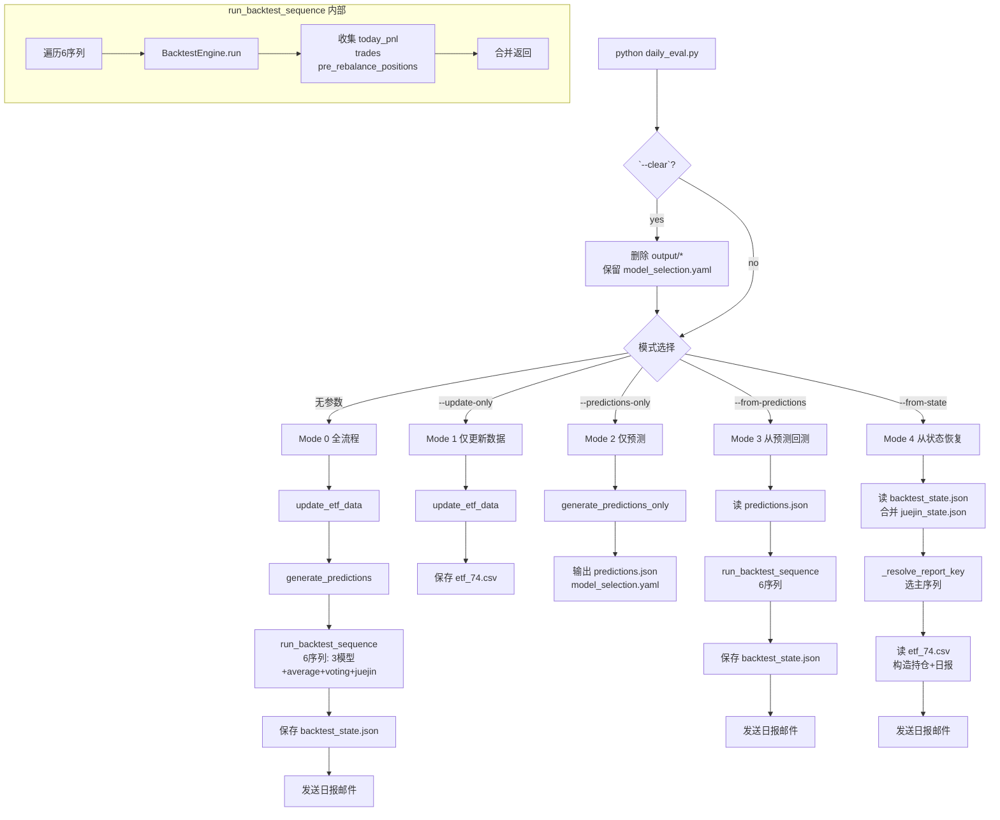

# Workflow



## Daily Report Generation (5 modes)

Any mode supports `--clear` to delete old output files first (preserves `model_selection.yaml`):
```bash
python code/src/daily_eval.py --clear --from-state
```

### Mode 0: Full pipeline (模型推理 + 回测 + 日报)
```bash
python code/src/daily_eval.py
```
流程: `update_etf_data()` → `generate_predictions()` → `run_backtest_sequence()`(6序列: 3模型+average+voting+juejin占位) → 保存 `backtest_state.json` → `send_report()`

### Mode 1: Update data only (仅更新数据)
```bash
python code/src/daily_eval.py --update-only
```
只下载更新 ETF 日线数据到 `etf_74.csv`。

### Mode 2: Predictions only (仅模型推理，保存预测信号)
```bash
python code/src/daily_eval.py --predictions-only
```
Saved to `output/predictions.json` + `model_selection.yaml`. Skips backtest/report.

### Mode 3: Report from saved predictions (用已保存的预测信号)
```bash
python code/src/daily_eval.py --from-predictions
```
读 `predictions.json` → `run_backtest_sequence()`(6序列) → 保存 `backtest_state.json` → 生成并发送日报。

### Mode 4: Report from backtest state (从回测状态生成日报)
```bash
python code/src/daily_eval.py --from-state
```
读 `backtest_state.json` + 合并 `juejin_state.json` → `_resolve_report_key()` 选主序列 → 读 `etf_74.csv` → 构造持仓(close+调仓日→旧持仓) → 生成并发送日报。

### Typical three-step workflow
```bash
# Step 1: update data
python code/src/daily_eval.py --update-only

# Step 2: generate predictions (slow, needs model)
python code/src/daily_eval.py --predictions-only --no-update

# Step 3: generate report from saved predictions (fast)
python code/src/daily_eval.py --from-predictions --no-update
```

### Juejin-based workflow
```bash
# Step 1: update data
python code/src/daily_eval.py --update-only

# Step 2: generate predictions + local backtest (6 sequences: 3 models + average + voting + juejin placeholder)
python code/src/daily_eval.py --from-predictions --no-update

# Step 3: run Juejin backtest (reads predictions.json, merges "juejin" sequence into state)
python juejin/main.py

# Step 4: generate report from backtest state (master: juejin → 掘金作主序列)
python code/src/daily_eval.py --from-state
```

## Juejin Strategy

### juejin/main.py
- Reads `output/predictions.json` (raw model scores)
- Picks Top-K by score each rebalance day
- Executes trades via Juejin API
- Saves results as `"juejin"` sequence in `output/juejin_state.json` (独立文件)
- Also saves `output/juejin_result.json` for reference

### After Juejin backtest finishes
```bash
# Generate report with juejin as master sequence:
python code/src/daily_eval.py --from-state
```

### Sequence priority (report_key resolution)
1. `model_selection.yaml` → `master: juejin` (explicit)
2. Fallback: `juejin` → `average` → `voting` → first

## `run_backtest_sequence()` 内部
遍历 6 个序列（3 单模型 + average + voting + juejin）→ 每序列 `BacktestEngine.run()` → 收集 `today_pnl`、`trades`、`pre_rebalance_positions` → 合并返回。

## Critical: predictions.json must cover ALL trading days (not just rebalance days)

When `trade_mode="open"`, `BacktestEngine` calls `predictions_func(pred_date)` where `pred_date` = **previous trading day** (e.g., 2026-04-08 for 2026-04-09 rebalance). If `predictions.json` only has rebalance-day entries, the lookup returns `None` and the rebalance is skipped → 0 trades.

`generate_predictions_only()` correctly iterates over all `seed_dates` (= all backtest dates + seed day before start). But if predictions.json was saved via `_save_predictions()` from the full pipeline (Mode 0), it only contains rebalance days because `predictions_history` is populated only when `predictions_func` is called (= rebalance days only).

**Always regenerate predictions.json via `--predictions-only` after any data or model change.**
```bash
python code/src/daily_eval.py --predictions-only --no-update
```

## Test Commands
```bash
python -m py_compile code/src/daily_eval.py
python -m py_compile code/src/send_report.py
python -m py_compile juejin/main.py
```
